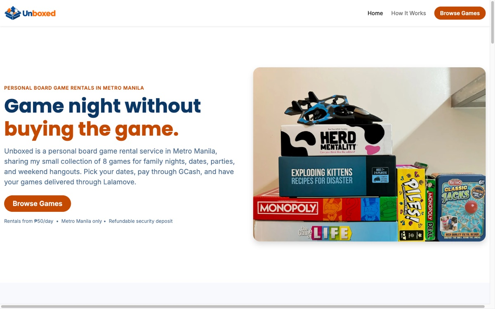

# Unboxed

A personal board game rental site for Metro Manila — browse games, check availability, book, and pay via GCash, with delivery and returns handled through Lalamove.

**Live site:** [unboxed.liandrejohn.com](https://unboxed.liandrejohn.com/)

Blog posts about this project:

- [Why I Built Unboxed](https://liandrejohn.com/blog/why-i-built-unboxed)
- [How I Built Unboxed](https://liandrejohn.com/blog/how-i-built-unboxed)

## Screenshot



## Features

- **Game catalog** — 8 personal board games (Monopoly, Exploding Kittens, Monopoly Deal, Game of Life, Herd Mentality, Piles, RC Plane, Jackstones), backed by MongoDB
- **Date-range availability checker** — checks each game against existing confirmed/out-for-delivery/rented/return-pending bookings
- **Multi-game booking** with a sticky booking summary (pricing, 10% multi-game discount, security deposits, grand total)
- **Delivery address autocomplete** — Google Places Autocomplete with a map pin, hard-blocks addresses outside Metro Manila
- **GCash checkout** — QR code + reference number, server-validated and priced end-to-end via a Server Action
- **Booking confirmation** — booking number, status, and details shown on submission; admin notified by email via Resend
- **SEO/AEO** — metadata, JSON-LD (`LocalBusiness`, `ItemList`/`Product`, `FAQPage`, `HowTo`), sitemap/robots, and `llms.txt`
- **Analytics** — GA4 page views + custom event tracking (optional, gated behind an env var)

## Tech Stack

- [Next.js](https://nextjs.org/) (App Router, JavaScript)
- [React](https://react.dev/)
- [Bootstrap](https://getbootstrap.com/) + [Bootstrap Icons](https://icons.getbootstrap.com/)
- [Sass](https://sass-lang.com/) (Dart Sass)
- [MongoDB](https://www.mongodb.com/) & [Mongoose](https://mongoosejs.com/)
- [Resend](https://resend.com/) — booking notification email (server-side)
- [Google Maps Platform](https://developers.google.com/maps) (Places Autocomplete + Maps JavaScript API) — delivery address field, optional
- [Google Analytics](https://analytics.google.com/) (GA4, via `@next/third-parties`) — optional
- [react-toastify](https://fkhadra.github.io/react-toastify/) — add-to-booking confirmation toasts

Deployed on [AWS Amplify](https://aws.amazon.com/amplify/).

## Getting Started

Install dependencies:

```sh
npm install
```

Start the dev server:

```sh
npm run dev
```

Then open [http://localhost:3000](http://localhost:3000).

Build and run a production build:

```sh
npm run build
npm start
```

### MongoDB

The app expects a local MongoDB instance. Install it (e.g. `brew install mongodb-community`) and start it, or run it via Docker:

```sh
docker run -d -p 27017:27017 --name unboxed-mongo mongo
```

By default the app connects to `mongodb://localhost:27017/unboxed`. To point at a different URI, copy `.env.example` to `.env` and set `MONGODB_URI`:

```sh
cp .env.example .env
```

Seed the database with the 8 games and 2 sample bookings from `src/data/games.json` / `src/data/bookings.json`:

```sh
npm run seed
```

This drops and repopulates the `games` and `bookings` collections. `connectDB` (`src/lib/mongodb.js`) caches the connection across hot reloads, and `Game`/`Booking` models live in `src/models/`.

## Environment Variables

All variables are optional except `MONGODB_URI` (which itself has a local-dev default). Copy `.env.example` to `.env` and fill in what you need:

| Variable                          | Required | Description                                                                                          |
| ---------------------------------- | -------- | ------------------------------------------------------------------------------------------------------ |
| `MONGODB_URI`                      | No       | MongoDB connection string. Defaults to `mongodb://localhost:27017/unboxed`.                            |
| `NEXT_PUBLIC_SITE_URL`             | No       | Absolute site URL used for metadata, canonical links, OG/Twitter images, and the sitemap. Falls back to `http://localhost:3000`. |
| `NEXT_PUBLIC_GOOGLE_MAPS_API_KEY`  | No       | Enables Google Places Autocomplete + map pin on the delivery address field. Without it, a plain text input is used instead. |
| `NEXT_PUBLIC_GA_MEASUREMENT_ID`    | No       | GA4 measurement ID. Without it, no Google Analytics script is loaded.                                  |
| `RESEND_API_KEY`                   | No       | Server-only key used to send the admin booking notification email via [Resend](https://resend.com/). Without it, bookings still save normally, just with no email sent. |

### Google Maps setup

Create a browser API key in [Google Cloud Console](https://console.cloud.google.com/) restricted to the **Places API** and **Maps JavaScript API** (and to your site's HTTP referrers).

### Booking email notification setup

When a booking is submitted, the `createBooking` Server Action sends the booking details (number, customer info, games, dates, total, GCash reference) server-side via Resend to the admin inbox, right after the booking is saved. Create a Resend account and API key to enable it — the key is server-only and never reaches the client bundle. Emails send from Resend's shared `onboarding@resend.dev` address, since the only recipient is the account owner's own address.

## Project Structure

```
├── .claude/skills/feature/  # Feature workflow skill (load/start/complete a feature)
├── context/                 # Project context read by Claude Code (see CLAUDE.md)
│   ├── project-overview.md  # Product plan: pricing, policies, booking flow, data model
│   ├── ai-interaction.md    # AI workflow/communication guidelines
│   ├── coding-standards.md  # Bootstrap/Sass coding conventions
│   ├── current-feature.md   # Active feature spec + completed feature history
│   ├── contents/            # Page copy (Home, Game Listing)
│   └── features/            # Per-feature specs
├── docs/
│   └── screenshot.jpg        # README screenshot
├── scripts/
│   └── seed.mjs              # Seeds MongoDB from src/data/games.json + bookings.json
├── src/
│   ├── app/                 # Next.js App Router pages (home `/`, games `/games`) + actions/ (Server Actions)
│   ├── components/          # Shared UI (Navbar, Footer, modals, game card)
│   ├── data/                  # MongoDB seed JSON (games.json, bookings.json)
│   ├── lib/                  # connectDB (MongoDB) + small formatting helpers
│   ├── models/                # Mongoose models (Game, Booking)
│   └── scss/                 # Sass source (main.scss imports Bootstrap + overrides in _variables.scss)
├── public/
│   ├── img/                  # Site images (committed)
│   └── fonts/                # Bootstrap Icons fonts (generated, gitignored)
└── next.config.mjs
```

`public/fonts/` and `.next/` are build output, not committed — `npm run dev`/`npm run build` regenerate `public/fonts/` automatically, and Next.js regenerates `.next/`.

## Commands

| Script                 | Description                                                |
| ---------------------- | ----------------------------------------------------------- |
| `npm install`          | Install dependencies                                         |
| `npm run dev`          | Starts the Next.js dev server (syncs icon fonts first)       |
| `npm run build`        | Production build (syncs icon fonts first)                    |
| `npm start`            | Serves the production build                                  |
| `npm run assets:icons` | Re-syncs Bootstrap Icons fonts into `public/fonts/`           |
| `npm run seed`         | Seeds local MongoDB from `src/data/games.json` + `bookings.json` |
